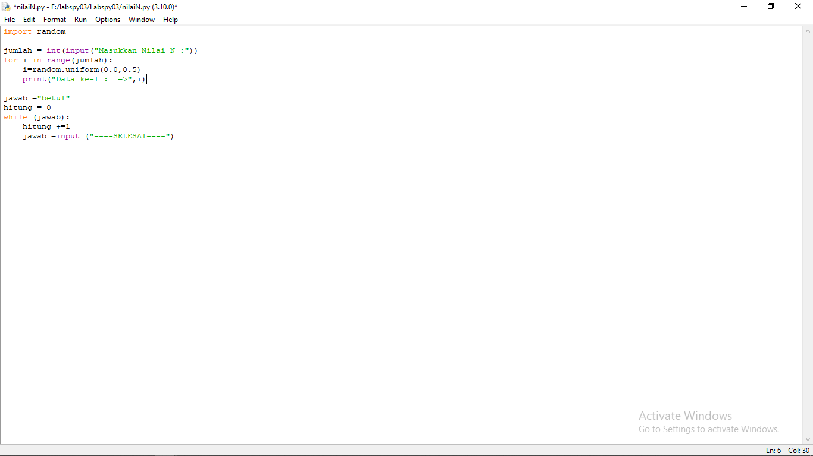
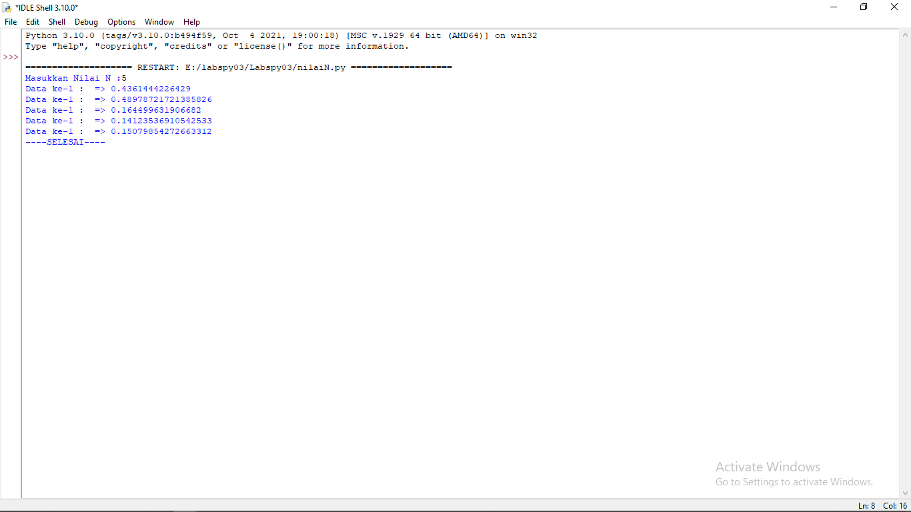
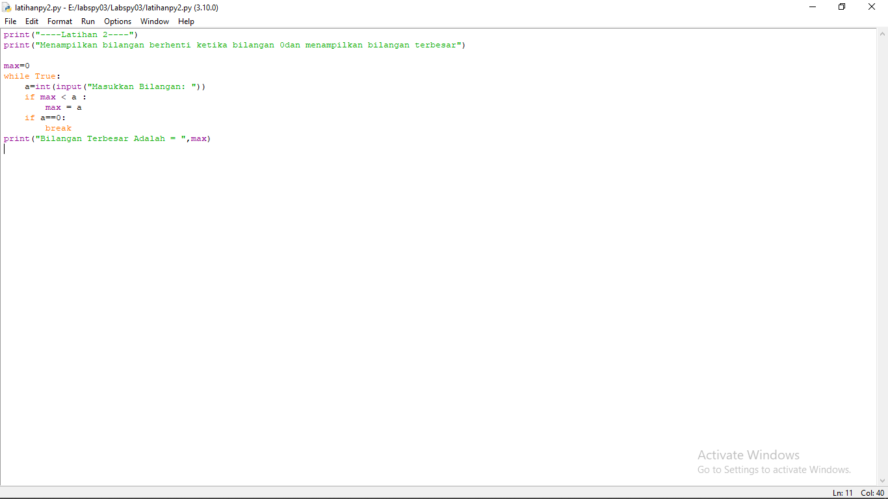
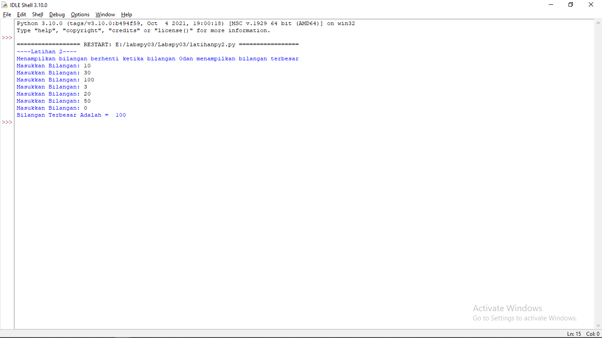
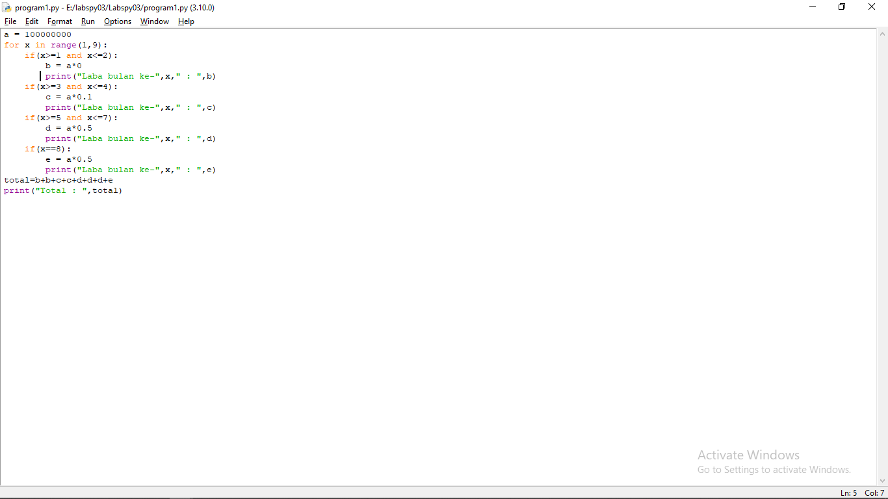
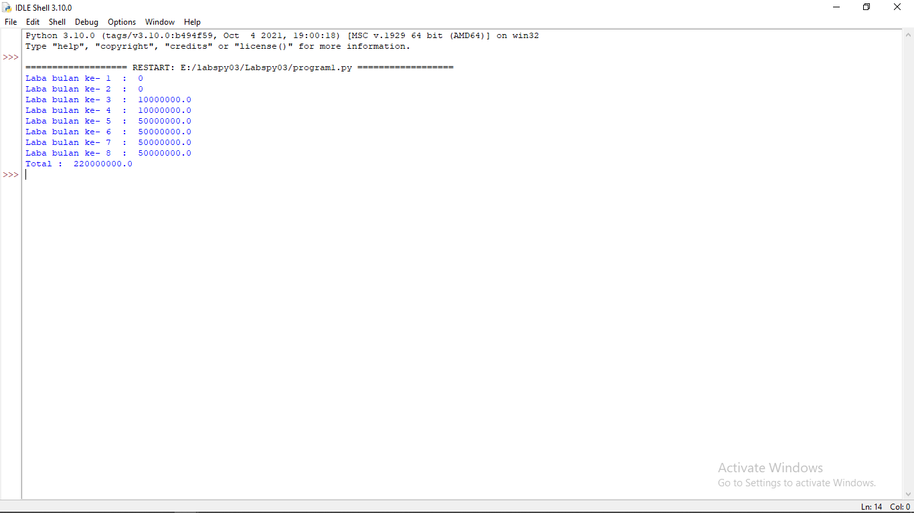

# Labspy03
## Latihan 1

	import random

	jumlah = int(input("Masukkan Nilai N :"))
	for i in range(jumlah):
    	i=random.uniform(0.0,0.5)
    	print("Data ke-1 :  =>",i)

	jawab ="betul"
	hitung = 0
	while (jawab):
    	hitung +=1
    	jawab =input ("----SELESAI----")

### CONTOH INPUT

### TAMPILAN SETELAH DI RUN

## Latihan 2

	print("----Latihan 2----")
	print("Menampilkan bilangan berhenti ketika bilangan 0dan menampilkan bilangan terbesar")

	max=0
	while True:
    	a=int(input("Masukkan Bilangan: "))
    	if max < a :
        max = a
    	if a==0:
        	break
	print("Bilangan Terbesar Adalah = ",max)

### CONTOH INPUT

### TAMPILAN SETELAH DI RUN

## Program 1

	a = 100000000
	for x in range(1,9):
    	if(x>=1 and x<=2):
        	b = a*0
        	print("Laba bulan ke-",x," : ",b)
    	if(x>=3 and x<=4):
        	c = a*0.1
        	print("Laba bulan ke-",x," : ",c)
    	if(x>=5 and x<=7):
        	d = a*0.5
        	print("Laba bulan ke-",x," : ",d)
    	if(x==8):
        	e = a*0.5
        	print("Laba bulan ke-",x," : ",e)
	total=b+b+c+c+d+d+d+e
	print("Total : ",total)

### CONTOH INPUTNYA

### TAMPILANNYA SETELAH DI RUN
